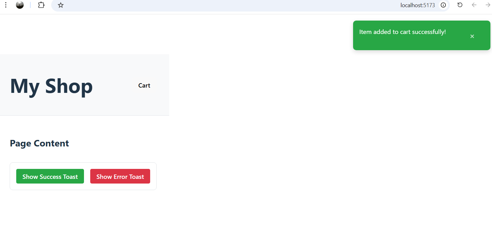

# Homework 3: Global Client State + Persistence + Notifications

This document contains the notes and deliverables for the homework assignment.

---

## Step 1 — State Inventory

The state inventory for this project can be found in the [State-Inventory.md](./State-Inventory.md) file.

---

## Step 2 — Context-Based Sidebar (Global UI State)

### Context Design

*   **Context Fields:** The context provides a boolean field `isCartOpen`.
*   **Context Actions:** It exposes three functions to control the state: `openCart()`, `closeCart()`, and `toggleCart()`.

### Implementation Screenshot

*(Here you would add a screenshot or GIF of the sidebar opening and closing)*

---

## Step 3 — Persist Sidebar with a Custom localStorage Hook

### Custom Hook Description

The `useLocalStorage` custom hook works like `useState` but initializes its value by reading from `localStorage` and uses an `useEffect` to write any changes back to `localStorage`. This ensures the state persists across page refreshes. It is used inside the `CartSidebarProvider` to manage the `isCartOpen` state.

### Persistence Test Results

*   “Opened sidebar, refreshed → still open”
*   “Closed sidebar, refreshed → still closed”

---

## Step 4 — Global Toast Store (Zustand)

### Library Choice

*   **Library:** Zustand
*   **Reason:** I chose Zustand because it is a very lightweight and simple state management library. It uses a hook-based API that doesn't require wrapping the application in a context provider, which makes it ideal for managing global state that is not directly tied to a specific component subtree, like notifications.
*   **Store Location:** `src/stores/notifications.ts`

### Store Design

*   **Notification Shape:** A notification object includes an `id` (number), `type` ('success' | 'error' | 'info'), and a `message` (string).
*   **Store API:** The store exposes the list of `notifications` and provides actions to `addNotification(notification)`, `removeNotification(id)`, and `clearAll()`.

### Implementation Screenshot

